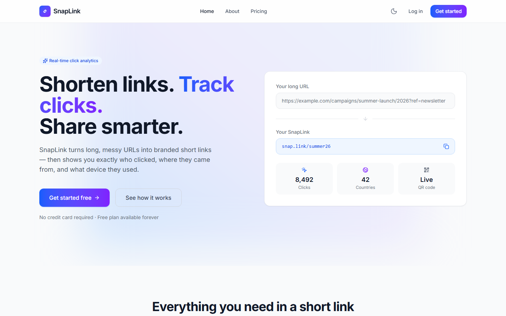
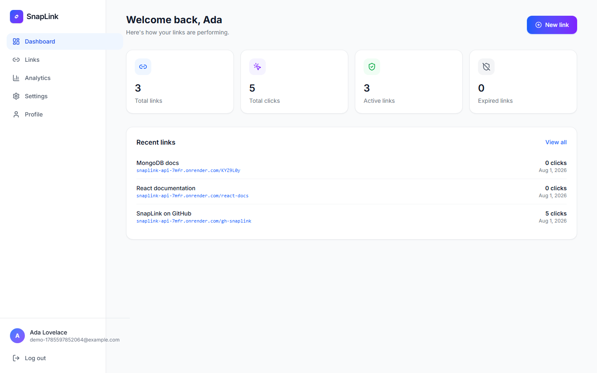
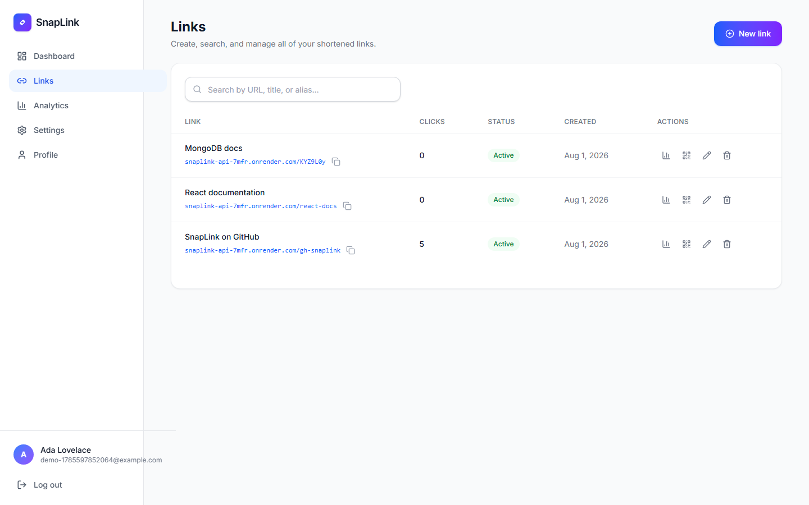
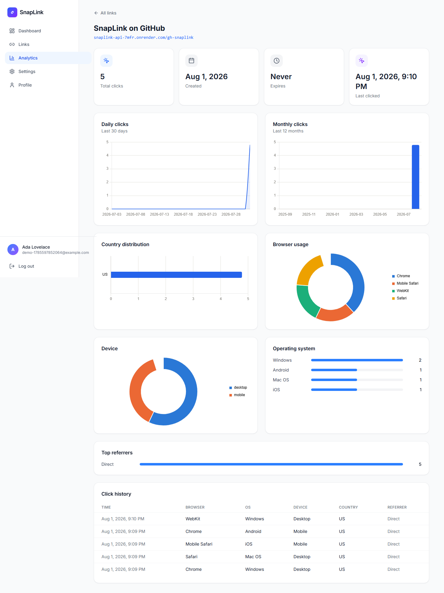

# SnapLink

**Shorten links. Track clicks. Share smarter.**

SnapLink is a full-stack URL shortener: custom aliases, QR codes, link expiration, and a
real analytics dashboard (clicks over time, browser/device/OS/country/referrer breakdowns,
click history) for every link you create.


## Table of contents

- [Overview](#overview)
- [Screenshots](#screenshots)
- [Features](#features)
- [Tech stack](#tech-stack)
- [Project structure](#project-structure)
- [Getting started](#getting-started)
  - [Prerequisites](#prerequisites)
  - [Installation](#installation)
  - [Environment variables](#environment-variables)
  - [Running locally](#running-locally)
  - [Running with Docker](#running-with-docker)
  - [Tests](#tests)
- [API documentation](#api-documentation)
- [Security](#security)
- [Deployment](#deployment)
- [Future improvements](#future-improvements)

## Overview

SnapLink turns long URLs into short, shareable links and gives you real visibility into
who clicks them — not just a raw counter. It's built as a monorepo with a Node/Express/
MongoDB API and a React/Vite single-page app, structured the way a small production
service actually would be: layered backend (routes → controllers → services → models),
validated input on every mutating endpoint, JWT auth with silent refresh, and a frontend
that mirrors the same domain boundaries (services, hooks, typed API contracts).

## Screenshots

| Landing page                                  | Dashboard                                    |
| --------------------------------------------- | -------------------------------------------- |
|  |  |

| Links                                | Analytics                                    |
| ------------------------------------ | -------------------------------------------- |
|  |  |

## Features

**Public**

- Landing page (hero, features, how it works, testimonials, pricing, FAQ)
- About and Pricing pages
- Register / log in (JWT access token + httpOnly refresh cookie, silent re-auth on reload)

**Dashboard**

- Create shortened links with an optional custom alias, title, and expiration date
- Edit and delete links; searchable, paginated link list
- Copy the short link to the clipboard; open it in a new tab
- Auto-generated QR code per link, downloadable as a PNG
- Stat cards (total links, total clicks, active/expired) and a recent-links widget
- Settings (theme) and Profile pages

**Analytics** (per link)

- Total clicks, created/expiration dates, last-clicked time
- Daily clicks (last 30 days) and monthly clicks (last 12 months) charts
- Country distribution, browser usage, and device breakdown charts
- Operating system and referrer rankings
- Recent click history (browser, OS, device, country, referrer, timestamp)

**Cross-cutting**

- Full dark mode (persisted, applied before first paint)
- Responsive, accessible UI with Framer Motion micro-interactions

## Tech stack

**Frontend** — React 19, Vite, TypeScript, Tailwind CSS v4, React Router, Axios, TanStack
Query, Framer Motion, React Hook Form, Zod, Chart.js

**Backend** — Node.js, Express, TypeScript, MongoDB, Mongoose, JWT, bcryptjs, nanoid,
`qrcode`, `ua-parser-js`, `fast-geoip`, Winston

**Tooling** — ESLint 9 (flat config), Prettier, Husky + lint-staged, Vitest + Supertest +
mongodb-memory-server, Docker, GitHub Actions

Two deliberate substitutions from the more commonly-named packages, both to keep
`npm audit` clean:

- **bcryptjs instead of bcrypt** — the native `bcrypt` package pulls in
  `@mapbox/node-pre-gyp`, which drags in install-time-only `tar`/`glob` versions with
  known critical advisories. `bcryptjs` is API-identical and pure JS (no native build
  step, which also simplifies the Docker image).
- **fast-geoip instead of geoip-lite** — `geoip-lite` is unmaintained with its own
  vulnerable dependency chain and a network-dependent postinstall step; `fast-geoip` is
  actively maintained and has neither issue.

## Project structure

```
snaplink/
├── client/                      # React + Vite frontend
│   ├── src/
│   │   ├── components/
│   │   │   ├── ui/              # Button, Input, Card, Modal, Pagination, ...
│   │   │   ├── layout/          # Navbar, Footer, PublicLayout, DashboardLayout, ...
│   │   │   ├── sections/        # Landing page sections (Hero, Features, FAQ, ...)
│   │   │   ├── dashboard/       # LinkFormModal, QrCodeModal, StatCard, ...
│   │   │   └── charts/          # TimeSeriesChart, CategoryBarChart, ...
│   │   ├── pages/                # Route-level components (+ pages/dashboard/*)
│   │   ├── context/              # AuthContext
│   │   ├── hooks/                # useLinks, useLinkAnalytics, useTheme, ...
│   │   ├── services/             # Typed API clients (api.ts, auth/link/analytics.service.ts)
│   │   ├── validators/            # Zod schemas shared by the forms
│   │   ├── types/                 # Shared TS types matching backend responses
│   │   ├── lib/                   # Chart.js setup + theme
│   │   └── utils/                 # cn, format, errorMessage, shortLink, ...
│   ├── Dockerfile
│   └── nginx.conf
├── server/                       # Express + TypeScript backend
│   ├── src/
│   │   ├── config/                # env validation, db connection, logger, constants
│   │   ├── models/                 # User, Link, ClickEvent (Mongoose)
│   │   ├── validators/              # Zod request schemas
│   │   ├── middleware/               # auth, validate, rateLimiter, errorHandler
│   │   ├── services/                  # Business logic (auth, link, redirect, analytics)
│   │   ├── controllers/                # Thin request/response glue
│   │   ├── routes/                      # Route wiring
│   │   ├── utils/                        # AppError, catchAsync, jwt, qrcode, ...
│   │   └── __tests__/                     # Vitest + Supertest integration suite
│   └── Dockerfile
├── docker-compose.yml
└── .github/workflows/ci.yml
```

## Getting started

### Prerequisites

- Node.js 20+
- A MongoDB instance — local (`mongod`), [Atlas](https://www.mongodb.com/atlas) free
  tier, or via Docker Compose (see below)

### Installation

```bash
git clone https://github.com/sumit6511/snaplink.git
cd snaplink
npm install
```

This installs both workspaces (`client` and `server`) via npm workspaces.

### Environment variables

Copy each example file and fill in real values:

```bash
cp server/.env.example server/.env
cp client/.env.example client/.env
```

**`server/.env`**

| Variable                 | Description                                                    | Default                 |
| ------------------------ | -------------------------------------------------------------- | ----------------------- |
| `NODE_ENV`               | `development` \| `test` \| `production`                        | `development`           |
| `PORT`                   | Port the API listens on                                        | `5000`                  |
| `CLIENT_URL`             | Frontend origin, used for CORS                                 | `http://localhost:5173` |
| `BASE_URL`               | Public URL this API's redirects resolve from                   | `http://localhost:5000` |
| `MONGODB_URI`            | MongoDB connection string                                      | — (required)            |
| `JWT_SECRET`             | Access token signing secret (16+ chars)                        | — (required)            |
| `JWT_EXPIRES_IN`         | Access token lifetime                                          | `15m`                   |
| `JWT_REFRESH_SECRET`     | Refresh token signing secret (16+ chars, different from above) | — (required)            |
| `JWT_REFRESH_EXPIRES_IN` | Refresh token lifetime                                         | `7d`                    |
| `RATE_LIMIT_WINDOW_MS`   | General API rate-limit window                                  | `900000` (15 min)       |
| `RATE_LIMIT_MAX`         | Max requests per window per IP                                 | `300`                   |
| `SHORT_CODE_LENGTH`      | Length of auto-generated short codes                           | `7`                     |

**`client/.env`**

| Variable           | Description                                                                                                                                    | Default                 |
| ------------------ | ---------------------------------------------------------------------------------------------------------------------------------------------- | ----------------------- |
| `VITE_BACKEND_URL` | Base URL the backend serves redirects from — used only to display/copy the full short link; API calls go through the dev proxy / nginx instead | `http://localhost:5000` |

### Running locally

```bash
npm run dev
```

This runs both workspaces concurrently: the API on `http://localhost:5000` and the
frontend on `http://localhost:5173` (Vite proxies `/api` to the backend, so no CORS
setup is needed in dev). Or run them individually:

```bash
npm run dev:server
npm run dev:client
```

### Running with Docker

```bash
cp server/.env.example server/.env   # fill in real JWT secrets
docker compose up --build
```

This starts MongoDB, the API, and the frontend (served via nginx, which proxies `/api`
to the API container) — client at `http://localhost:8080`, API at
`http://localhost:5000`. Intended for local development/demo use; see
[Deployment](#deployment) for production.

### Tests

```bash
npm test --workspace=server   # Vitest + Supertest integration suite
npm test --workspace=client   # Vitest + Testing Library unit/component suite
```

The server suite runs against an in-memory MongoDB (`mongodb-memory-server`, which
downloads a real `mongod` binary on first use). The client suite covers validators,
formatting/URL utilities, and UI components with `@testing-library/react` + jsdom.

## API documentation

All endpoints are JSON over HTTPS and prefixed with `/api`, except the short-link
redirect itself, which is intentionally at the root so links stay short.

| Method | Endpoint                   | Auth           | Description                                                         |
| ------ | -------------------------- | -------------- | ------------------------------------------------------------------- |
| POST   | `/api/auth/register`       | —              | Create an account, returns an access token + sets a refresh cookie  |
| POST   | `/api/auth/login`          | —              | Log in                                                              |
| POST   | `/api/auth/refresh`        | Refresh cookie | Mint a new access token                                             |
| POST   | `/api/auth/logout`         | —              | Clear the refresh cookie                                            |
| GET    | `/api/user/profile`        | Bearer token   | Current user's profile                                              |
| POST   | `/api/links`               | Bearer token   | Create a short link                                                 |
| GET    | `/api/links`               | Bearer token   | List your links (`?page&limit&search`)                              |
| GET    | `/api/links/stats/summary` | Bearer token   | Aggregate stats (total links/clicks, active/expired)                |
| GET    | `/api/links/:id`           | Bearer token   | Get one link (must be owned by the caller)                          |
| PUT    | `/api/links/:id`           | Bearer token   | Update a link                                                       |
| DELETE | `/api/links/:id`           | Bearer token   | Delete a link and its click history                                 |
| GET    | `/api/analytics/:id`       | Bearer token   | Full analytics for one link (breakdowns, timeseries, click history) |
| GET    | `/:shortCode`              | —              | Resolve a short code/alias and redirect (records a click)           |

Every mutating endpoint validates its input with Zod and returns `400` with field-level
errors on failure. Endpoints scoped to a link return `404` (not `403`) when the link
exists but belongs to another user, so ownership isn't leaked through the response code.

## Security

- Passwords hashed with bcrypt (cost 12); login runs a bcrypt comparison on every
  attempt, including for a nonexistent email, so response timing can't be used to
  enumerate registered accounts.
- JWT access tokens are short-lived and kept in memory on the client (never
  `localStorage`); the longer-lived refresh token lives in an httpOnly cookie scoped to
  `/api/auth`, with `sameSite=strict` in development and `sameSite=none; secure` in
  production (frontend and API are on different domains in a split deployment, so the
  browser treats every API call as cross-site — `strict`/`lax` would never be sent back).
- Helmet, tiered rate limiting (auth/API/redirect), `express-mongo-sanitize`, and `hpp`
  are applied globally.
- Link URLs are restricted to `http(s)` — Zod's plain URL check would otherwise also
  accept `javascript:`/`data:` schemes.
- CORS is locked to `CLIENT_URL`, not a wildcard.
- `app.set('trust proxy', 1)` assumes exactly one reverse proxy hop in front of the API
  (Nginx, a load balancer, etc.). **Only enable this when actually deployed behind one** —
  otherwise a client can spoof its own `X-Forwarded-For` header and bypass IP-based rate
  limiting.

## Deployment

Live reference deployment: [MongoDB Atlas](https://www.mongodb.com/atlas) (free M0) +
[Render](https://render.com) (API) + [Vercel](https://vercel.com) (frontend) — all free
tiers. In dependency order:

1. **Database (Atlas)** — create a free cluster, add a database user, allow access from
   `0.0.0.0/0` (Render's free tier has no static IP), and copy the connection string.
   Add the database name before the `?`: `.../snaplink?retryWrites=true&w=majority`.
2. **Backend (Render)** — new Web Service, connect the repo:
   - Root Directory: `server`
   - Build Command: `cd .. && npm ci --include=dev && npm run build --workspace=server`
   - Start Command: `node dist/server.js`
   - Env vars: everything in the `server/.env` table above, with `MONGODB_URI` from step
     1, `BASE_URL` set to this service's own Render URL, and `CLIENT_URL` filled in after
     step 3.

   **`--include=dev` is required, not optional.** Render sets `NODE_ENV=production`
   during the build by default, which makes plain `npm ci` skip devDependencies —
   including `typescript`, which the build itself needs. (The repo's root
   `"prepare": "husky || true"` script exists for the same reason: without it, that same
   devDependency-skipping breaks the install itself, since husky — meaningless outside a
   local dev checkout anyway — isn't there for npm's auto-run `prepare` step to find.)

3. **Frontend (Vercel)** — new Project, import the repo:
   - Root Directory: `client`
   - Framework Preset: Vite (auto-detected)
   - Env vars: `VITE_BACKEND_URL` = the Render URL from step 2

   Two things this repo already accounts for, worth knowing if you deploy elsewhere:
   `client/vercel.json` adds the SPA rewrite Vercel needs to serve `index.html` for
   client-side routes like `/login` or `/dashboard` (without it, every route but `/`
   404s directly from Vercel, and every page reload would too). And because the frontend
   and API end up on different domains, `services/api.ts` builds an absolute API base URL
   from `VITE_BACKEND_URL` instead of the relative `/api` path that only resolves via a
   proxy (Vite's dev server locally, nginx in Docker Compose) — set that env var for any
   static host that doesn't proxy `/api` itself.

4. Back in Render, set `CLIENT_URL` to the Vercel URL from step 3 and redeploy — this is
   what lets CORS accept requests from the live frontend.

Alternatively, both `Dockerfile`s work for a container-based deploy (Fly.io, a VPS,
etc.) — same environment variables, just supplied as container config instead of a
platform dashboard, and pointing each service's env vars at the others' public URLs
instead of the Compose network's service names.

## Future improvements

Not implemented yet, in roughly the order they'd add the most value:

- Password reset and email verification
- A scheduled job to purge (or archive) expired links and their click history
- Bulk URL import and CSV export of links/analytics
- Custom domains per account
- PWA support (offline shell, installability)
- Redis-backed rate limiting (the current in-memory store doesn't share state across
  multiple server instances)
